# Task - User Management System

## Light Theme

| 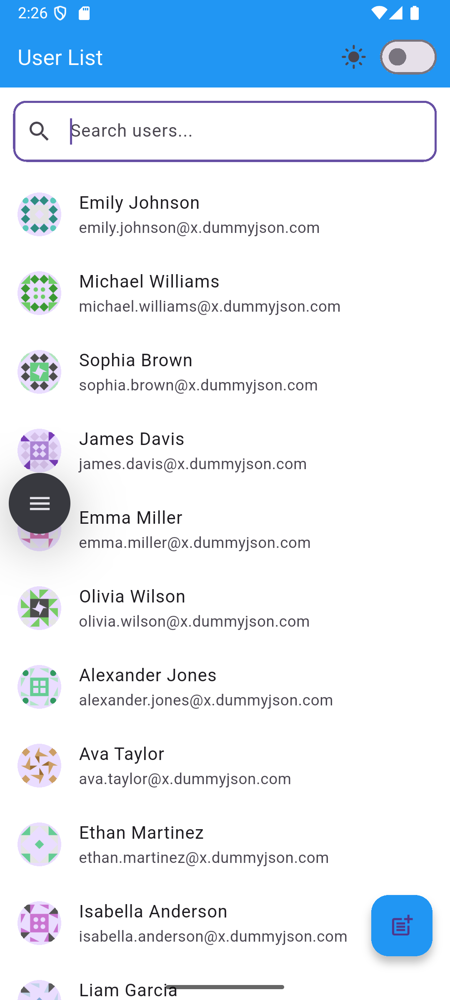 | 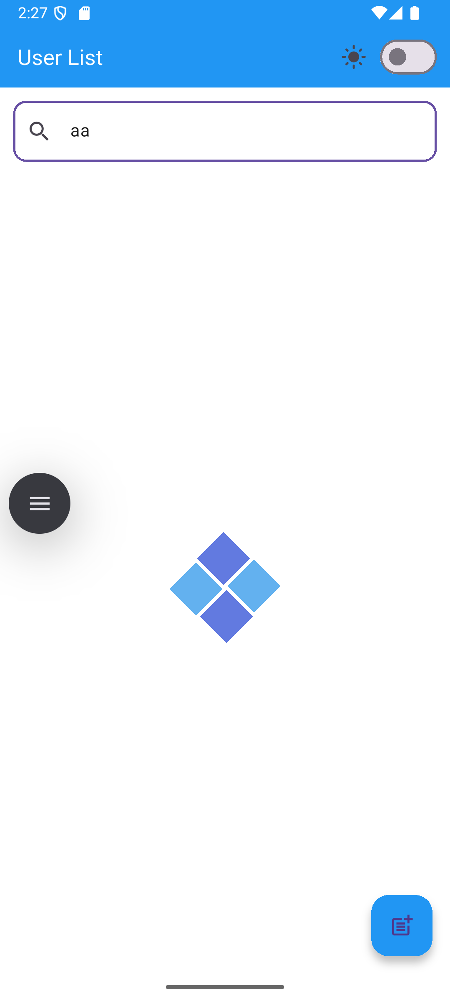 | 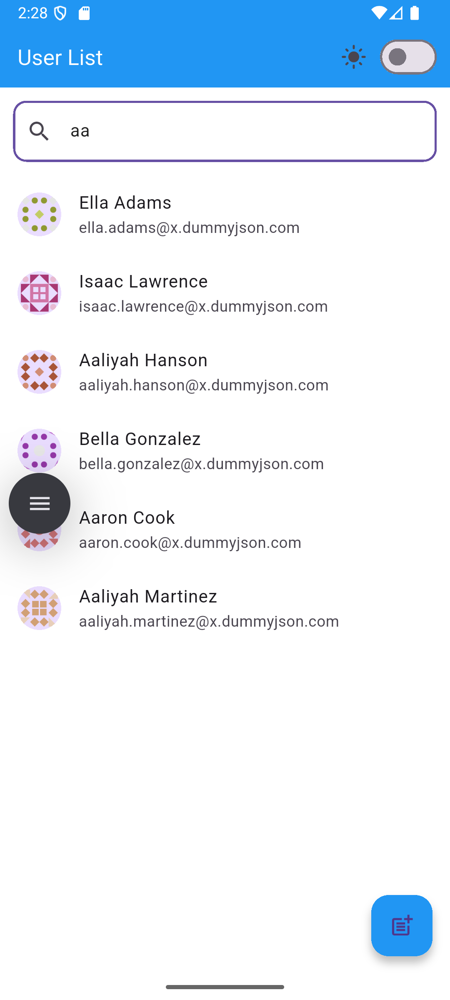 | 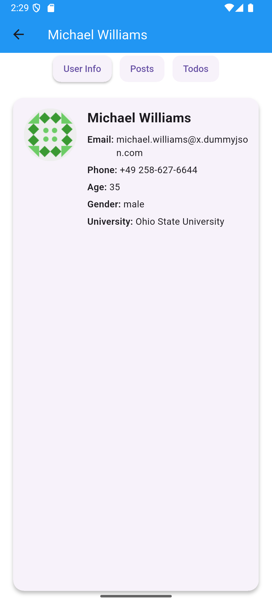 | 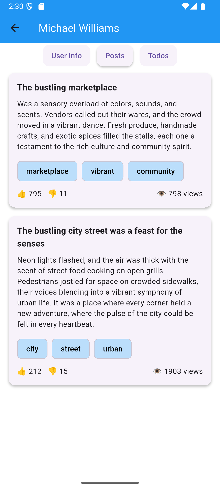 | 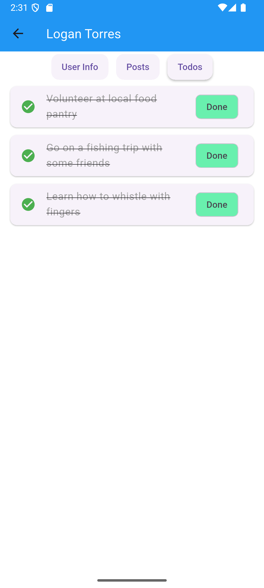 | 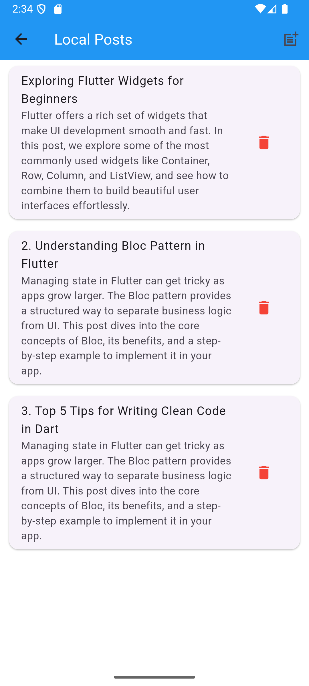 | 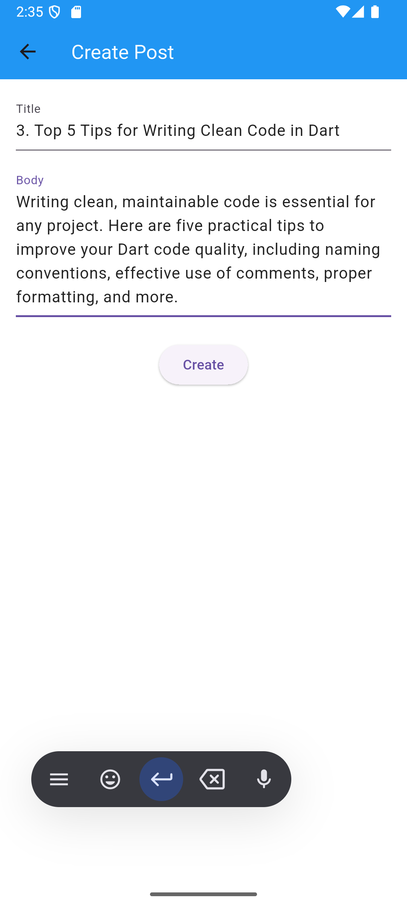 |
|------------------------------------------|-------------------------------------|--------------------------------------|------------------------------------------|----------------------------------------|--------------------------------------|--------------------------------------------|---------------------------------------------|
| User List                               | Loading                            | Searching                           | User Info                               | Posts                                 | Todos                               | Local Post                                 | Create Post                                 |

## Dark Theme

| 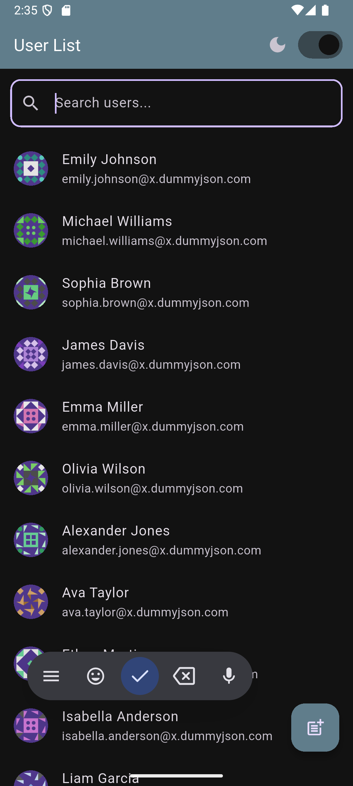 | 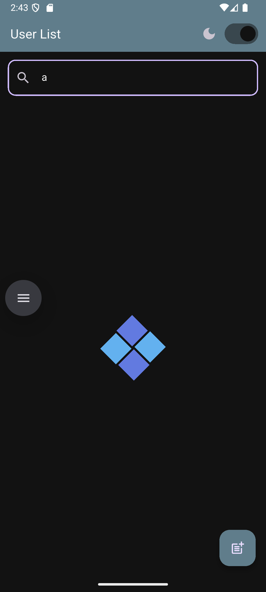 | 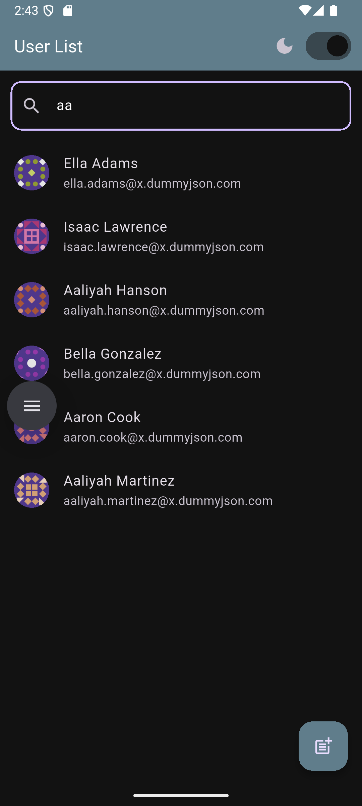 | 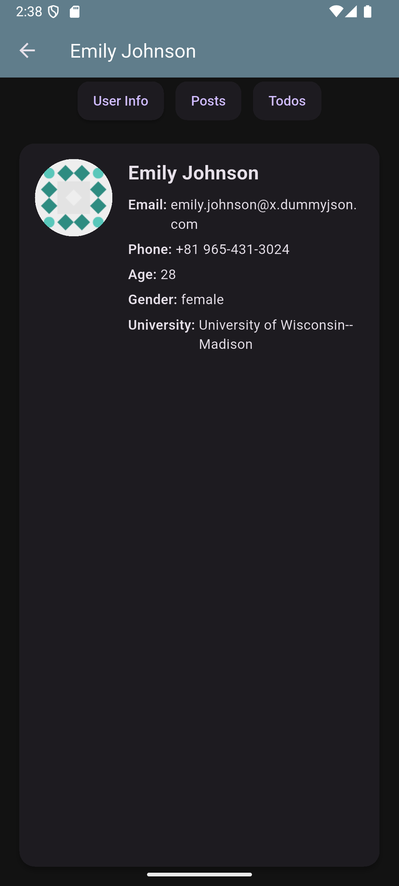 | 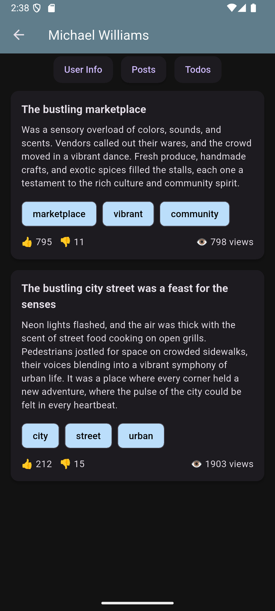 | 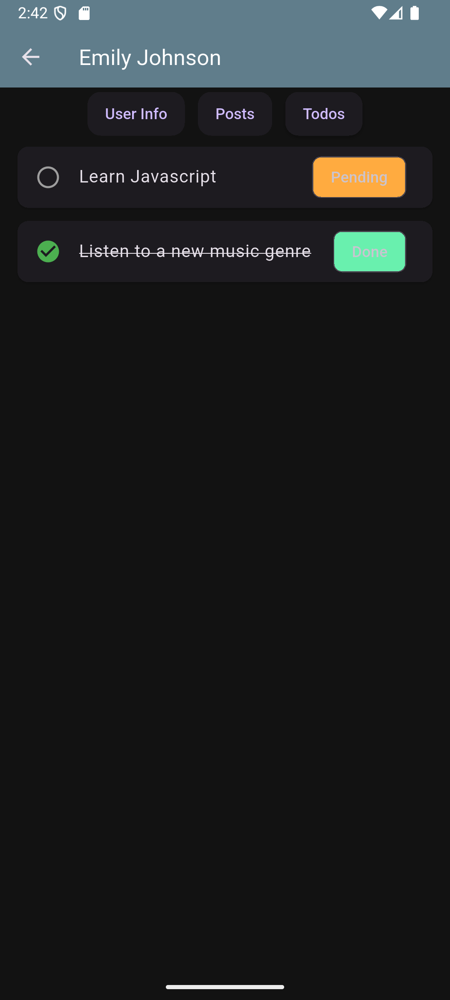 | 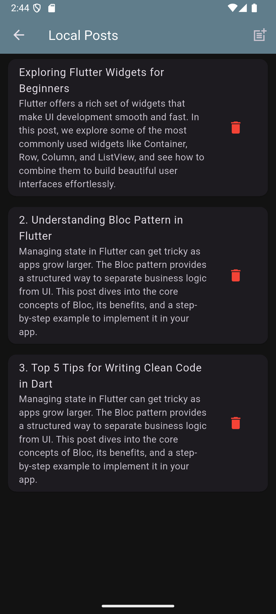 | 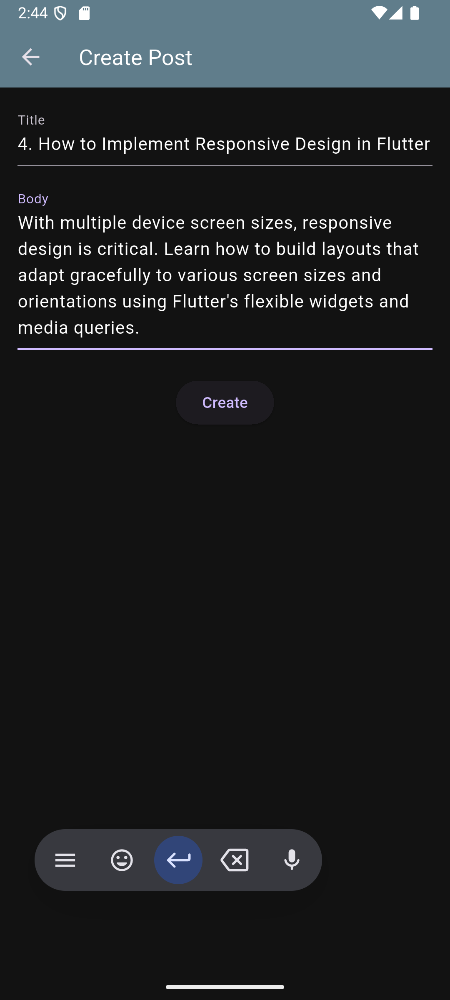 |
|---------------------------------------------|-------------------------------------|--------------------------------------|------------------------------------------|-------------------------------------|------------------------------------|-----------------------------------------------|---------------------------------------------|
| User List                                  | Loading                            | Searching                           | User Info                               | Posts                               | Todos                             | Local Post                                    | Create Post                                 |

---
## Setup Instructions

### 1. Prerequisites
- Install [Flutter SDK](https://flutter.dev/docs/get-started/install) (version 3.0 or higher recommended)
- Install [Android Studio](https://developer.android.com/studio) or [VS Code](https://code.visualstudio.com/) with Flutter & Dart plugins
- Set up an emulator or connect a physical device for testing

### 2. Clone the repository and installation

```bash
# Clone the repository to your local machine
git clone https://github.com/oxiion-code/Task_04_25.git

# Navigate into the project directory
cd Task_04_25

# Fetch all the required Flutter dependencies
flutter pub get

# Run code generation for Hive adapters and other generated files
flutter packages pub run build_runner build

# Launch the app on connected device or emulator
flutter run
```
---

## Project Overview

The **User Management System** is a Flutter application built to demonstrate clean architecture, proper state management using BLoC, and effective API integration. The core functionalities include:

- 📦 Fetching user data from the [DummyJSON API](https://dummyjson.com/users)
- 🔍 Real-time search functionality by user name
- 🔄 Pagination using `limit` and `skip` parameters with infinite scroll
- 👤 Viewing user details including posts and todos
- 📝 Creating and storing user posts locally using Hive
- 🌗 Theme switching between light and dark modes
- 🚀 Smooth user experience with loading indicators and error handling

This project follows modular structure and clean code practices for better scalability and maintainability.

## Architecture Explanation

The project follows a clean and modular architecture using the BLoC pattern to manage state and ensure separation of concerns.

### 📁 Folder Structure Overview

```bash
lib/
│
├── blocs/                  # Business logic components (BLoC)
│   ├── theme/             # Theme switching logic
│   ├── user_detail/       # Manages state for user details (posts & todos)
│   └── user_list/         # Manages user list, pagination, and search
│
├── models/                # Data models representing API and local data
│   ├── local_post.dart
│   ├── post_model.dart
│   ├── todo_model.dart
│   └── user_model.dart
│
├── repositories/          # Handles API integration and data fetching
│   └── user_repository.dart
│
├── screens/               # UI screens of the application
│   ├── create_post_screen.dart
│   ├── local_post_screen.dart
│   ├── user_detail_screen.dart
│   └── user_list_screen.dart
│
├── theme/                 # Theme configuration
│   ├── app_colors.dart
│   └── app_theme.dart
│
└── widgets/               # Reusable UI components
    ├── loading_animation.dart
    ├── post_tile.dart
    ├── todo_tile.dart
    └── user_tile.dart

```
### 🧠 State Management (BLoC)

The app uses the `flutter_bloc` package to manage state efficiently:

- **user_list_bloc**: Handles fetching users, search, and pagination.
- **user_detail_bloc**: Manages fetching an individual user's posts and todos.
- **theme_bloc**: Toggles between light and dark themes.

---

### 📡 Data Layer

- The app integrates with the **DummyJSON API** to fetch user data, posts, and todos:
    - `https://dummyjson.com/users`
    - `https://dummyjson.com/posts/user/{userId}`
    - `https://dummyjson.com/todos/user/{userId}`
- Local post creation is handled using **Hive**, a lightweight and fast key-value database for Flutter.

---

### 🔍 Search Optimization

- For real-time and efficient search, the app uses:
    - `flutter_debouncer` for debounced input handling
    - `rxdart` for stream-based data processing and transformation

This ensures that API calls are not triggered on every keystroke, improving both performance and user experience.

---

### 🎨 UI Layer

- Each screen is modular and corresponds to a specific feature:
    - User list
    - User detail view (posts & todos)
    - Create post
    - View local posts
- The app supports both **Light** and **Dark** themes.
- Reusable UI components like:
    - `UserTile`
    - `PostTile`
    - `TodoTile`
    - `LoadingAnimation`  
      are used across the app for consistent design and separation of concerns.


